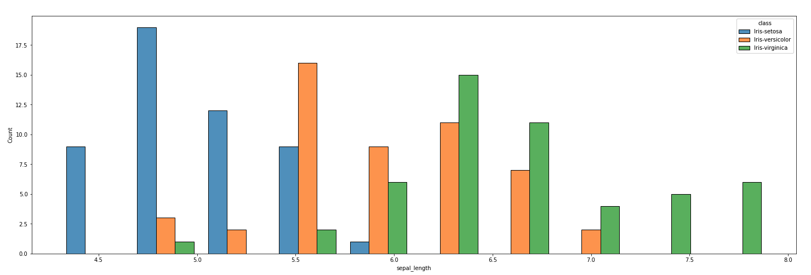
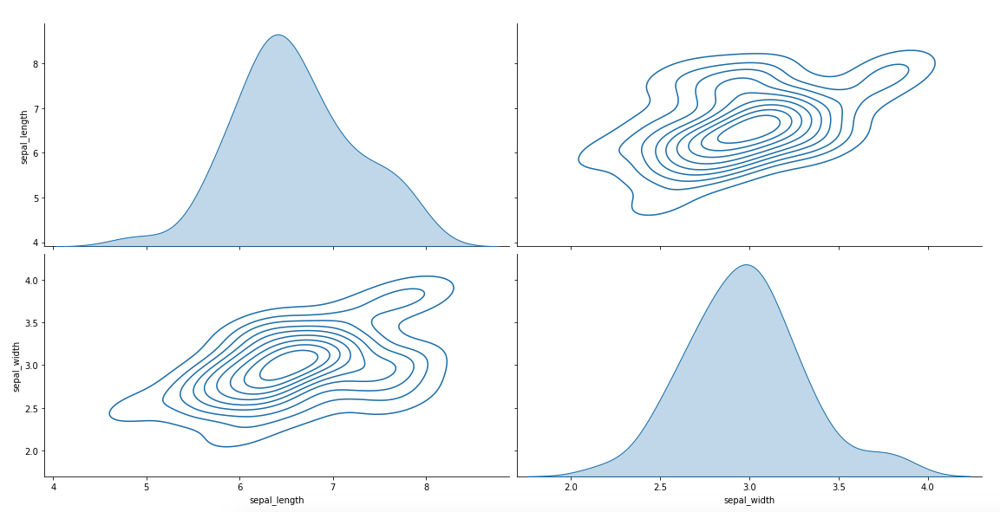

# Data Analytics Library for Python 
<div align="center"></div>

## Overview
 * Python library to do end to end data analytics from reading to transformation, analysis and visualization.
 * Support for reading and writing multiple data formats from local machine or S3.
 * Functional programming style APIs.
 * Advanced APIs for doing join, aggregate, sampling, and processing time series data.
 * Schema evolution.
 * Visualization APIs to provide simple interface to matplotlib, seaborn, and other popular libraries.

## Primary Use Cases 
 * Data Exploration phase when we don't know what we are looking for, and what might work.
 * Wide datasets with 100s or 1000s of columns.
 * Complex business logic is involved. 

## Internal Data Format
 * TSV is used as the in-memory data format for simplicity.
 * Input data can be of different formats and read either locally or from external sources like S3 or web.

## Run through Docker
#### Build image (first time only)
```
docker build -t omigo-data-analytics -f deploy/Dockerfile .
```

#### Run docker image
```
docker run --rm -p 8888:8888 -it -v $PWD:/code omigo-data-analytics
```

## Install Instructions
There are two packages: core and extensions. 

The core package is built using core python with minimal external dependencies to keep it stable.
The extensions package contains libraries for advanced functionalities like visualization, and can have lot of dependencies.

```
pip3 install omigo-core omigo-ext --upgrade
```

There are APIs provided to create new extension packages for custom needs and plugin easily into the existing code (See [extend-class](example-notebooks/extend-class.ipynb)).

## Usage
*Note*: Some working examples are in jupyter [example-notebooks](example-notebooks) directory. Here is a simple example to run in command line.

#### Read data from local filesystem. Can also use s3 or web url.
```
python3
>>> from omigo_core import tsv
>>> x = tsv.read("data/iris.tsv.gz")
#
# other possible options
#
# x = tsv.read("data/iris.tsv")
# x = tsv.read("data/iris.tsv.zip")
# x = tsv.read("s3://bucket/path_to_file/data.tsv.gz")
# x = tsv.read("https://github.com/CrowdStrike/omigo-data-analytics/raw/main/data/iris.tsv")
```
#### Print basic stats like the number of rows
```
>>> print(x.num_rows())
150
```

#### Export to pandas data frame for nice display, or use any of pandas apis. 
```
>>> x.to_df(10)
  sepal_length sepal_width petal_length petal_width        class
0          5.1         3.5          1.4         0.2  Iris-setosa
1          4.9         3.0          1.4         0.2  Iris-setosa
2          4.7         3.2          1.3         0.2  Iris-setosa
3          4.6         3.1          1.5         0.2  Iris-setosa
4          5.0         3.6          1.4         0.2  Iris-setosa
5          5.4         3.9          1.7         0.4  Iris-setosa
6          4.6         3.4          1.4         0.3  Iris-setosa
7          5.0         3.4          1.5         0.2  Iris-setosa
8          4.4         2.9          1.4         0.2  Iris-setosa
9          4.9         3.1          1.5         0.1  Iris-setosa
```

#### Example of filtering data for specific column value and select specific columns
```
>>> y = x \
    .eq_str("class", "Iris-setosa") \
    .gt_float("sepal_width", 3.1) \
    .select(["sepal_width", "sepal_length"])

>>> y.show(5)

sepal_width	sepal_length
3.5        	         5.1
3.2        	         4.7
3.6        	         5.0
```
#### Import the graph extension package for creating charts
```
>>> from omigo_ext import graph_ext
>>> x.extend_class(graph_ext.VisualTSV).histogram("sepal_length", "class", yfigsize = 8)
```


#### Some of the more advanced graphs are also available
```
>>> x.extend_class(graph_ext.VisualTSV).pairplot(["sepal_length", "sepal_width"], kind = "kde", diag_kind = "auto")
```


#### The tsv file can be saved to local file system or s3
```
>>> tsv.write(y, "output.tsv.gz")
```

## Extensions
There are lot of extensions to add advanced functionalities
#### 1. Graphics and Visualization
This extension provides visualization APIs like linechart, barchart. 

#### 2. Read from Web Services
This extension provides APIs to call external web service for all the rows in the data. All web service parameters can be templatized and mapped to individual columns including url, query parameters, 
headers, and payload. The extension supports multi threading.

#### 3. Multi Threading
This extension provides a simple wrapper to call different APIs within a thread pool. Usually used inside other extensions.

#### 4. Kafka Reader
This extension allows reading the data through Kafka and return as tsv object. Lot of custom parameters are provided to simplify parsing of the data.

#### 5. Pandas
This extension is a placeholder for wrapping any interesting pandas apis like reading parquet file (local or s3).

#### 6. ETL
This extension provides APIS to read data that is stored in some ETL format. Useful for reading time series data stored in a partitioned manner.

## Documentation
* [README](README.md): Good starting point to get a basic overview of the library.
* [API Documentation](https://github.com/CrowdStrike/omigo-data-analytics/wiki/API-Documentation): Detailed API docs with simple examples to illustrate the usage.
* [example-notebooks](example-notebooks): Working examples to show different use cases.

## Notes from the author
* This library is built for simplicity, functionality and robustness. Good engineering practices are being followed slowly.
* More examples with real life use cases is currently in progress. Feel free to reach out for any questions. 
